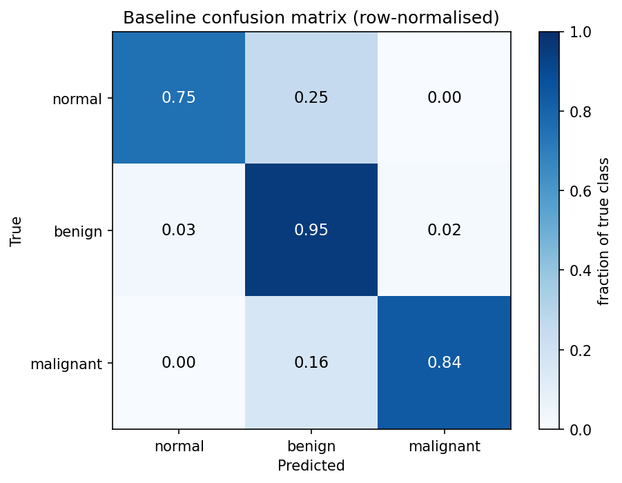
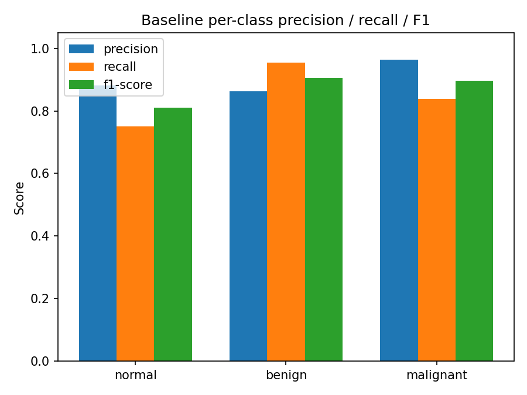
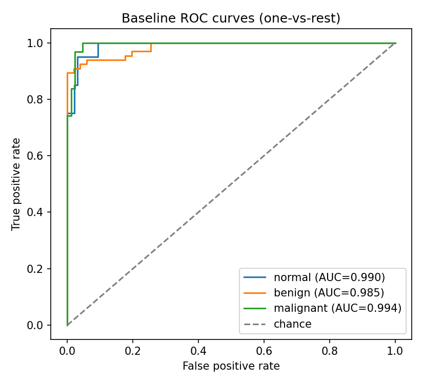
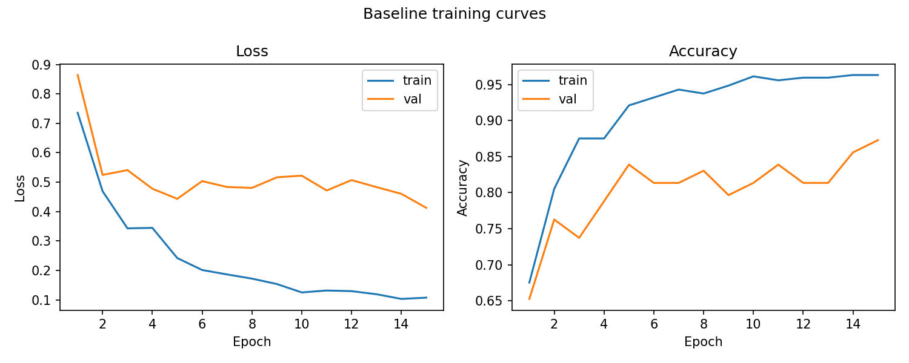
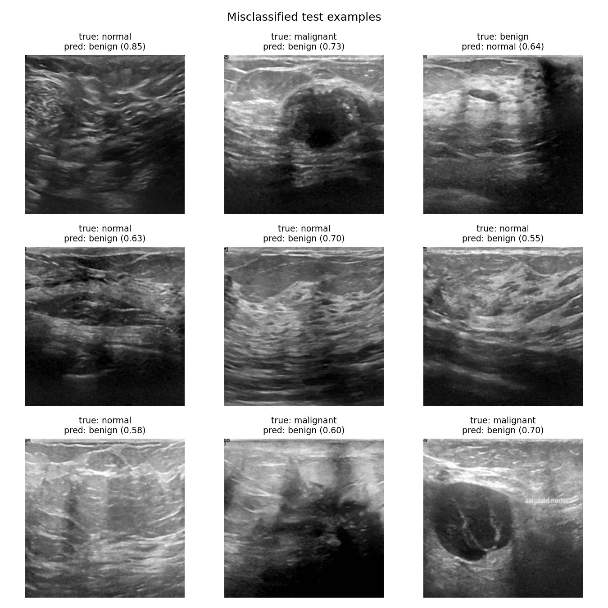
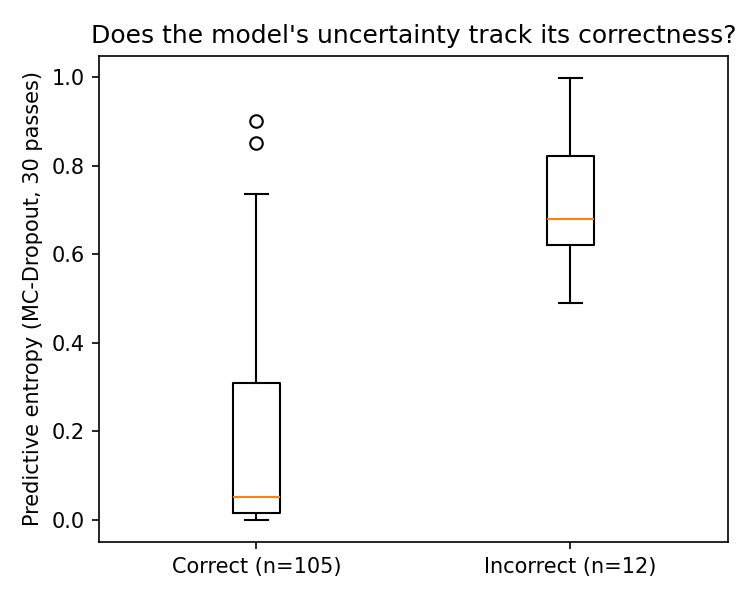
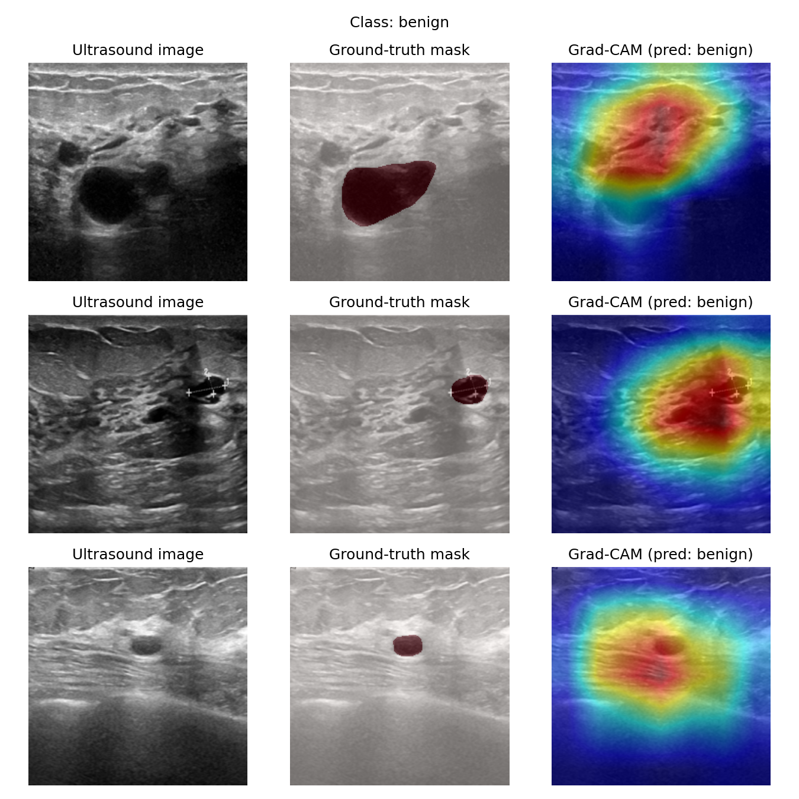
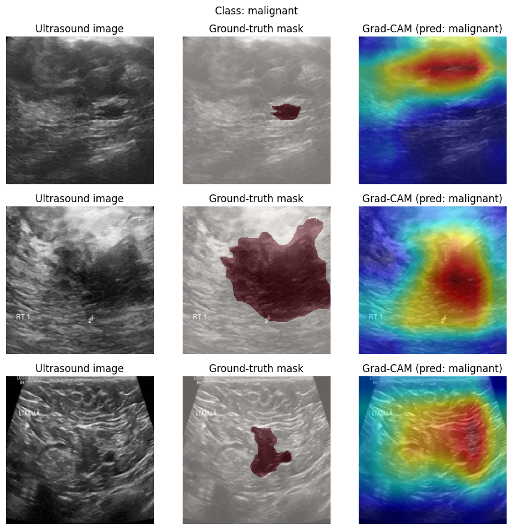
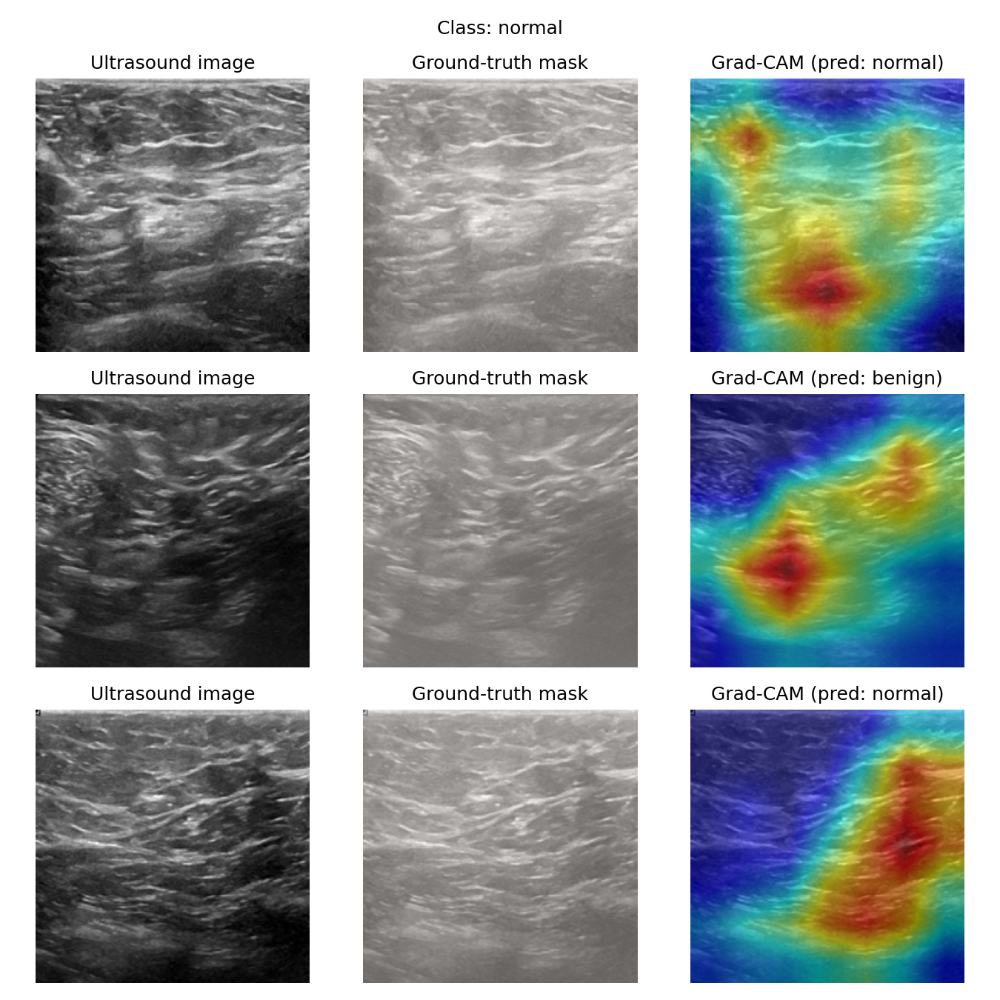

# Breast Ultrasound Classification with Grad-CAM Explainability

## Motivation

AI methods for breast cancer detection are only clinically useful if they are both accurate
and interpretable — a model that flags a scan as malignant without indicating why offers little
to a radiologist deciding whether to trust it. This project builds a CNN classifier for breast
ultrasound images and validates its explanations against radiologist-annotated lesion masks,
as a small-scale demonstration of the fair/explainable AI approach central to breast imaging
research.

## Method

**Dataset.** [BUSI (Breast Ultrasound Images)](https://www.kaggle.com/datasets/aryashah2k/breast-ultrasound-images-dataset):
780 images from 600 patients, labelled normal (133), benign (437), or malignant (210), each
with a ground-truth lesion segmentation mask.

**Split.** Stratified 70/15/15 train/validation/test split (545/118/117 images), preserving
class balance across all three sets.

**Model.** ResNet18, pretrained on ImageNet, fine-tuned on this task: the final convolutional
block (`layer4`) and classification head are trained, earlier layers are frozen. Training used
Adam (lr=1e-4) for 15 epochs, with the best validation-accuracy checkpoint kept for evaluation.

**Augmentation.** Random horizontal flip, small rotation (±10°), and colour jitter on the
training set only.

**Explainability.** Grad-CAM heatmaps were computed on `layer4` for held-out test images and
overlaid against the dataset's ground-truth segmentation masks, to check whether the regions
driving each prediction correspond to the actual lesion location rather than spurious
background texture.

## Results

Test accuracy: **88.9%** (104/117 correct).

| Class | Precision | Recall | F1 | Support |
|---|---|---|---|---|
| Normal | 0.88 | 0.75 | 0.81 | 20 |
| Benign | 0.86 | 0.95 | 0.91 | 66 |
| Malignant | 0.96 | 0.84 | 0.90 | 31 |

*(Precision: of everything the model called this class, what fraction actually was.
Recall: of everything that actually was this class, what fraction the model caught.
F1 is the balance of the two. Support is how many true test examples of that class there were.)*

Malignant precision is highest of the three classes (0.96), and critically, **no malignant
case was misclassified as normal** — the model's errors on malignant cases were confusions
with benign, the clinically safer failure mode. Most misclassifications involve normal images
being read as benign, plausibly because "normal" tissue can still contain benign-looking
structures not marked as lesions.

### Confusion matrix

A confusion matrix is just a table of "what the model predicted" vs. "what was actually true" —
the diagonal is correct predictions, everything off the diagonal is a specific kind of mistake
(e.g. row "malignant", column "benign" = a malignant case the model called benign).

Each cell shows the raw count and the row percentage. Rows are true classes, columns are
predicted classes.

This second version shows *only* the row percentages (0–1), which matters because the classes
are imbalanced (133 normal vs. 437 benign vs. 210 malignant) — in the raw-count version, the
minority classes visually look "smaller" even when the model handles them just as well
proportionally. Per class: normal 0.75, benign 0.95, malignant 0.84 correctly classified.

### Per-class precision / recall / F1, visualised

The same numbers as the table above, as a bar chart — makes it easy to see at a glance that
malignant precision (how much to trust a "malignant" call) is the strongest of the three, while
normal recall (catching every actual normal case) is the weakest.

### ROC curves

A ROC curve asks: as you slide the model's decision threshold from "flag almost nothing" to
"flag almost everything," how does the trade-off between catching true cases (true positive
rate) and false alarms (false positive rate) move? A perfect classifier hugs the top-left
corner; a random guess follows the diagonal ("chance" line). AUC (area under that curve)
summarises it as one number, where 1.0 is perfect and 0.5 is random.

All three classes land well above chance: normal AUC=0.990, benign AUC=0.985,
malignant AUC=0.994. This is a genuinely strong result and a useful complement to the accuracy
figure above — it shows the model separates the classes well in terms of *ranking* predictions
by confidence, even where the default 0.5 decision threshold produces some misclassifications.
In other words, several of the errors above are closer to a threshold-calibration issue than a
fundamental inability to tell the classes apart.

### Training curves

This shows how training and validation loss/accuracy moved over the 15 training epochs.
Training and validation tracking each other closely (rather than training loss dropping while
validation loss rises) is the standard visual check for overfitting — here they move together
reasonably well, consistent with the frozen-backbone approach being appropriately conservative
for a dataset this size.

### Misclassified examples

Actual test images the model got wrong, with the true label, the model's (incorrect)
prediction, and its confidence in that wrong prediction. This reveals a clean, consistent
failure pattern: essentially every error here is a case being over-called "benign" — normal
images read as benign, and the two malignant errors also misread as benign rather than normal.
There's no case of being confidently wrong in the clinically dangerous direction (missing a
real finding); the model's uncertainty consistently resolves toward the middle class rather
than either extreme.

### Uncertainty: does the model know when it doesn't know?

Accuracy alone doesn't tell you whether a model's mistakes are at least
*flagged* by low confidence, or whether it's just as confident when wrong as
when right. Using **MC-Dropout** (running many stochastic forward passes
with dropout active and looking at how much the predictions vary) gives a
per-image uncertainty score alongside the prediction itself, without
changing what the model outputs on average.

Because the trained baseline model didn't originally include a dropout
layer, this uses a fast **test-time dropout** variant: a dropout layer is
wrapped around the *same already-trained* classification weights (dropout
has no learnable parameters of its own, so nothing needed retraining — this
ran as a single inference pass, seconds not minutes). This is a quicker,
more approximate cousin of "proper" MC-Dropout, where the network is trained
from the start with dropout active so its weights adapt to be robust to it
— worth being upfront about that distinction rather than overstating rigor.

For each test image, the model was run 30 times with a different random
dropout pattern each time, giving 30 slightly different predictions per
image. **Predictive entropy** (how spread out the resulting average
probability is across the three classes — 0 if every pass agreed on one
class, higher if they disagreed) is the uncertainty score plotted here.

The result: mean entropy on **correct** predictions was **0.17**, vs. **0.71**
on **incorrect** predictions — over 4x higher, with almost no overlap between
the two groups. In plain terms: when this model is wrong, it also tends to
be visibly less sure of itself, which is exactly the property you'd want to
turn this into a practical triage signal ("route high-uncertainty cases to
a human reviewer") rather than trusting every prediction equally. (Averaging
predictions over the 30 stochastic passes gave 89.7% accuracy — consistent
with the original 88.9%, confirming the dropout noise isn't distorting the
model's actual behaviour.)

### Grad-CAM: does the model look at the right place?

Grad-CAM produces a heatmap of which pixels most influenced the model's decision. On its own
that's just a picture — the useful step is comparing it against the radiologist's own drawn
lesion outline (the "ground-truth mask") for the same image, to check the model is keying off
the actual lesion rather than something coincidental (a probe marker, image text, unrelated
tissue).

Each row is one test image: the plain ultrasound image, the same image with the ground-truth
lesion mask overlaid in red, and the Grad-CAM heatmap (red/yellow = high influence on the
prediction, blue = low). Across benign and malignant examples, the heatmap concentrates
directly over the annotated lesion in the large majority of cases — evidence the model learned
the lesion itself as the discriminative feature, not a confound.

## Discussion

At under 800 training images, a lightweight transfer-learning approach (freezing most of a
pretrained backbone) was appropriate — training a CNN from scratch on this dataset size would
likely overfit. The Grad-CAM/mask agreement suggests the model's predictions are grounded in
the correct anatomical region, which is the minimum bar for trusting a classifier's output in
a clinical-adjacent setting, though it does not by itself establish clinical validity.

## Limitations

- **Ultrasound, not mammography.** This project used BUSI (breast ultrasound) rather than a
  mammography dataset, chosen for its small size and fast turnaround. The same pipeline
  (transfer learning + Grad-CAM-vs-mask validation) transfers directly to mammography datasets
  such as CBIS-DDSM, given more compute and time.
- **No formal fairness/subgroup evaluation.** BUSI does not include demographic metadata
  beyond patient age ranges, so no subgroup fairness analysis (e.g. by density, age, ethnicity)
  was performed here — a natural next step for the "fair" half of fair/explainable AI.
- **Small test set (117 images).** Class-wise metrics, especially for the minority "normal"
  class, carry meaningful uncertainty at this sample size.
- **Grad-CAM overlap was assessed qualitatively**, not with a quantitative localisation metric
  (e.g. IoU between the CAM's thresholded region and the ground-truth mask), which would be a
  natural addition for a more rigorous evaluation.
